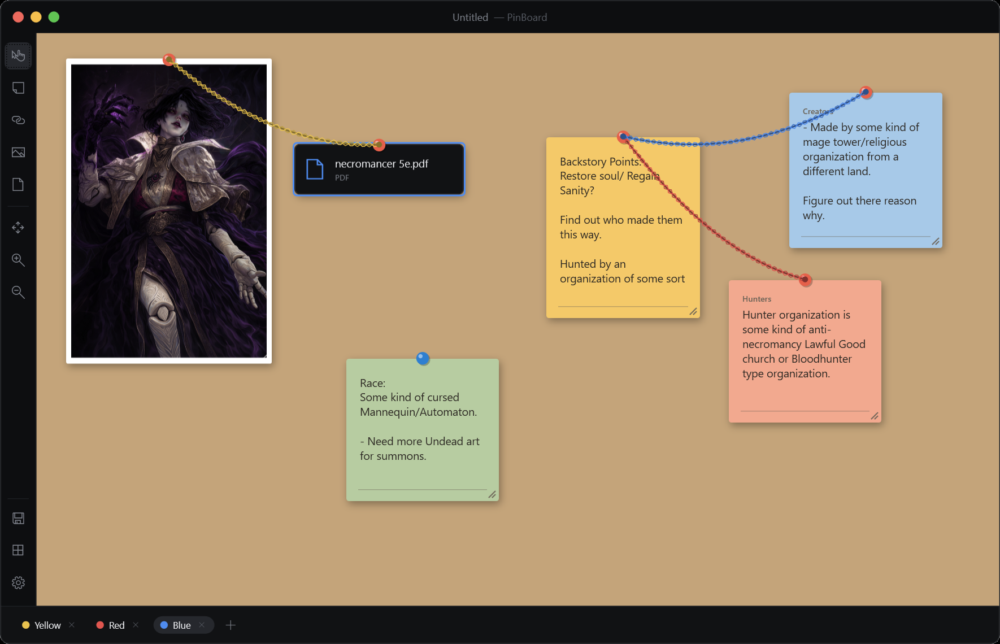

# PinBoard

A virtual corkboard for abstract planning — pin notes, string them together with ropes, and clip in images and documents. Fully local, no cloud, no accounts; every board is a single `.board` file.

[![CC BY-NC 4.0][cc-by-nc-shield]][cc-by-nc]



## Features

- **Sticky notes** — drag, resize, edit inline, add a category label and a colored pin; pick from a palette or a full color wheel.
- **Ropes** — connect any two notes or clips with a curved, twisted-rope line. Choose color and solid/dashed, add a label, and send ropes in front of or behind your notes. Save your own reusable rope types.
- **Image & document clips** — drag files straight onto the board (or pick them with a tool). Images show as framed, resizable thumbnails; documents as tidy cards. Double-click to open the file.
- **Infinite canvas** — pan with middle-drag or the Hand tool, scroll to zoom (25%–400%).
- **Themes** — six app UI themes (Midnight, Dark, Light, Sefora, Forest, Slate) plus six board backgrounds (four cork textures, dark dot-grid, plain) or a custom flat color.
- **Undo / redo**, **autosave on close**, and a global save folder you choose.
- **Keyboard-first** — `Q` note, `W` rope, `E` image, `R` document (all rebindable), `Ctrl+S` save, `Ctrl+O` open, `Ctrl+Z`/`Ctrl+Y` undo/redo, `Delete` to remove.

## Download & run

Grab `PinBoard.exe` from the [Releases](../../releases) page and run it — **no installation, no .NET required** (the runtime is bundled). Windows 64-bit.

> On first launch, Windows SmartScreen may show *"Windows protected your PC"* because the app isn't code-signed. Click **More info → Run anyway**.

Double-clicking a `.board` file opens it directly in PinBoard once you've run the app once.

## Build from source

Requires the [.NET 8 SDK](https://dotnet.microsoft.com/download).

```powershell
git clone https://github.com/BorisTakerman/PinBoard.git
cd PinBoard
dotnet run --project PinBoard
```

To produce a self-contained single-file build:

```powershell
dotnet publish PinBoard/PinBoard.csproj -c Release -r win-x64 --self-contained true `
  -p:PublishSingleFile=true -p:IncludeNativeLibrariesForSelfExtract=true `
  -p:EnableCompressionInSingleFile=true -p:DebugType=none
```

## Tech

C# / .NET 8, WPF (MVVM). No third-party UI libraries. Boards are plain JSON.

## License

This work is licensed under a
[Creative Commons Attribution-NonCommercial 4.0 International License][cc-by-nc].

[![CC BY-NC 4.0][cc-by-nc-image]][cc-by-nc]

[cc-by-nc]: https://creativecommons.org/licenses/by-nc/4.0/
[cc-by-nc-image]: https://licensebuttons.net/l/by-nc/4.0/88x31.png
[cc-by-nc-shield]: https://img.shields.io/badge/License-CC%20BY--NC%204.0-lightgrey.svg
